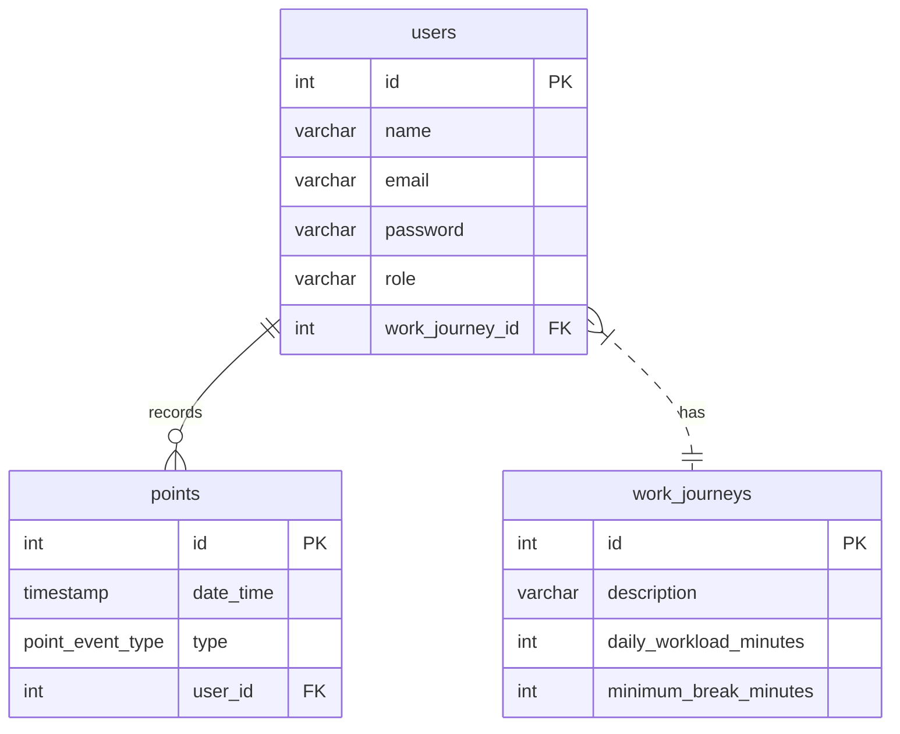

##  Funcionalidades Implementadas

* **Autenticação e Segurança**: O sistema é protegido por login e senha, e o acesso aos dados só é permitido após a autenticação.
* **Gestão de Usuários**:
    * Suporte a dois tipos de usuários: `MANAGER` e `EMPLOYEE`.
    * O Administrador pode cadastrar novos usuários comuns no sistema.
    * Ao cadastrar um novo usuário, o Administrador define seu regime de jornada.
* **Registro de Ponto**:
    * O usuário comum pode registrar um novo ponto informando a data/hora.
    * O sistema permite múltiplos registros em um mesmo dia, garantindo flexibilidade para pausas esporádicas.
* **Regimes de Jornada de Trabalho**:
    * Suporte ao regime de 6 horas contínuas de trabalho.
    * Suporte ao regime de 8 horas diárias com previsão de pausa mínima de 1 hora.
* **Cálculos de Jornada**:
    * **Resumo diário**: Apresenta os pontos do dia e se a jornada foi completada com base no regime do colaborador.
    * **Previsão de conclusão**: Calcula e informa o tempo restante para completar a jornada do dia.
    * **Horas excedentes**: Calcula e informa as horas extras trabalhadas no dia.

## 🗄️ Estrutura do Banco de Dados (DER)

O diagrama abaixo representa a arquitetura de dados da solução.

